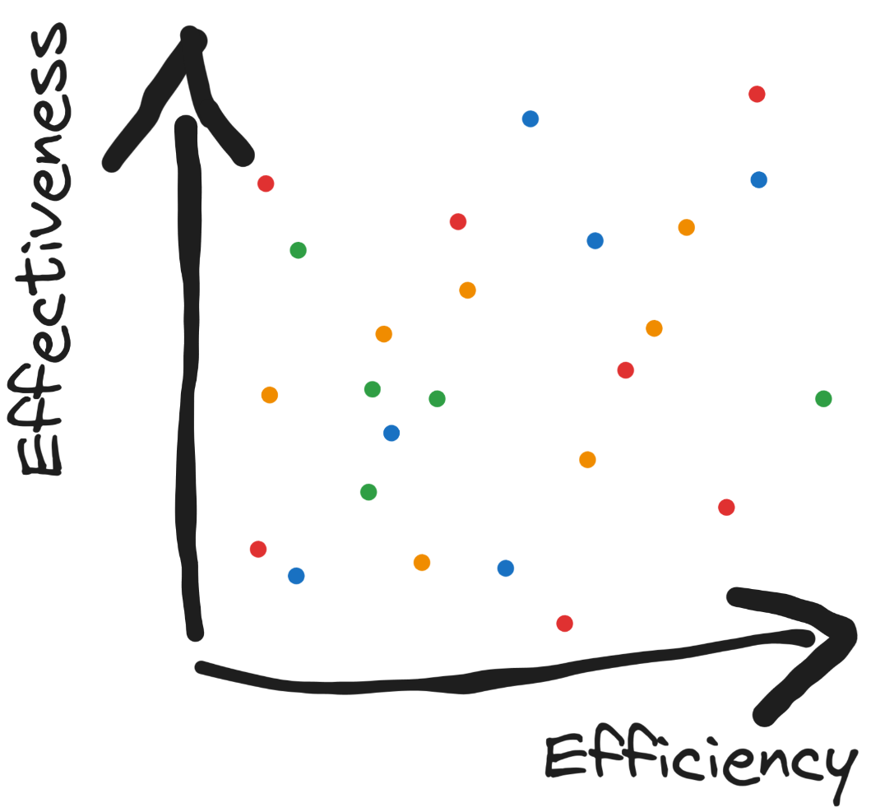
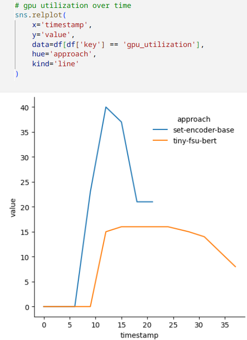
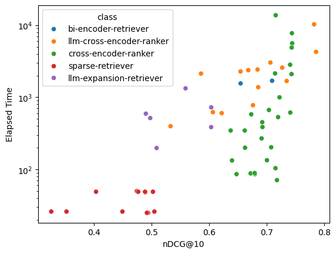

# Post-Hoc Analysis of Systems and their Telemetry within the ReNeuIr 2024 Shared Task

**Attention**: The [shared task is still ongoing](https://reneuir.org/shared_task.html). Please do not hesitate to submit new systems or to suggest additional datasets on which we could run all systems.

The goal of the ReNeuIR 2024 shared task is to foster the development of new performance measures that incorporate efficiency and effectiveness simultaneously. While our community converged on how to measure effectiveness, it remains an open research question on how to measure efficiency and trade it off for effectiveness.

To support research in this direction, we collect retrieval systems and monitor their execution within [TIRA](https://www.tira.io/)/[TIREx](https://webis.de/publications.html?q=TIRA#froebe_2023e) on the same hardware on different loads of datasets, aiming at painting an holistic picture of efficiency and effectiveness:

There could be many ways to realize the efficiency axis of this plot. To leave as much freedom as possible, we did execute all systems on the [same hardware](#hardware) while monitoring their GPU/CPU/memory consumption. All runs and their telemetry are available on [Zenodo](#resources-produced-within-the-shared-task), the [example-access-telemetry.ipynb] notebook shows how to access detailed telemetry data, e.g., how to compare the gpu utilization of two approaches over time like in this plot:

This plot shows that it can be difficult to measure efficiency through a single number, as one of the approaches finishes faster wheras the other approach needs fewer GPU resources (i.e., could run with higher parallelization). Still, both approaches operate in the same "order of magnitude", e.g., for a first closer look we could just try to distinguish effectiveness on a log scale, e.g., so that we distinguish if something runs within 1 second, 10 seconds, or 100 seconds (respectively needs a 400MB, 4GB, or 40GB GPU, etc.). For this, here is a efficiency versus effectiveness plot that shows the log of the elapsed time vs. nDCG@10:

This plot contains all systems that executed for the ReNeuIR task colored by their approach:

- bi-encoder-retriever: systems process queries and documents independently of each other, e.g., PLAID-X.
- cross-encoder-ranker: systems that process query-document pairs pointwise, pairwise, or listwise with a "traditional" transformer, e.g., MonoT5.
- llm-cross-encoder-ranker: systems that process query-document pairs pointwise, pairwise, or listwise with a large language model, e.g., RankLlama.
- llm-expansion-retriever: systems that expand the query with an large language model.
- sparse-retriever: traditional approaches like BM25, implemented in Anserini/PyTerrier, etc.

# Resources Produced within the Shared Task

The datasets and parallel corpora of run files together with telemetry for producing the run files is available on Zenodo[[datasets](https://zenodo.org/records/12722918), [runs with telemetry](https://zenodo.org/records/12728703)]. The notebooks in this directory contain examples on how to easily access those resources via the tira client.

This directory will contain jupyter notebooks analyzing/evaluating submitted systems.

Of course, many other interpretations of what efficiency means could be incorporated, we hope that we will have some nice discussions on this at the workshop.

# Further Details

### Datasets

We have different datasets that vary the size of documents respectively the size of queries. The main dataset for effectiveness evaluation is `reneuir-2024/dl-top-1000-docs-20240701-training`. Please have a look at the [overview-of-corpora.ipynb](overview-of-corpora.ipynb) notebook for an overview of the corpora.

### Hardware

All published telemetry was measured while executing the system on the [gammaweb09 host](https://webis.de/facilities.html#gammaweb). Each execution had access to 5 CPU cores, 50GB of RAM, one A100 GPU with 40GB and a timeout of 24 hours. All telemetry is included in the published runs on zenodo. If you have ideas for additional measures that we should include into our monitoring, please do not hesitate to contact us. For development, e.g., ensuring that systems work inside TIRA (e.g., software has no access to the internet connection in the TIRA sandbox), systems could be also executed on other hosts (e.g., the [betaweb](https://webis.de/facilities.html#betaweb) or [gammaweb](https://webis.de/facilities.html#gammaweb) cluster).

